# Système d'aide au diagnostic médical - Prédiction du cancer

Application web moderne développée avec Symfony pour la prédiction du cancer à partir de données médicales en utilisant des techniques de Machine Learning. Ce système intègre une interface conviviale pour l'exploration des données, l'analyse statistique, l'entraînement de modèles ML et la prédiction sur de nouvelles données.

##  Description du projet

DELTACANCE est un système d'aide au diagnostic médical permettant de prédire le cancer à partir de deux datasets complets :
- **Breast_Cancer.csv** : Dataset sur le cancer du sein avec 4000+ instances et 16 attributs cliniques et pathologiques
- **Cancer_Dataset.csv** : Dataset sur les patients avec 1000+ instances, 9 attributs et niveaux de prédiction (Low/Medium/High)

### Objectifs
- Analyser les facteurs de risque du cancer à partir de données réelles
- Comparer la performance de différents algorithmes de machine learning
- Fournir une interface web intuitive pour la prédiction et l'aide au diagnostic
- Visualiser les corrélations et distributions des données médicales

##  Fonctionnalités principales

### 1. **Exploration des données (Data Explorer)**
- Visualisation complète des datasets disponibles
- Description détaillée des attributs et statistiques de base
- Interface interactive pour naviguer parmi les données

### 2. **Analyse statistique avancée**
- **Statistiques descriptives** : Moyenne, médiane, écart-type, quartiles
- **Analyse de corrélation** : Matrice de corrélation entre tous les attributs
- **Distributions** : Visualisations des distributions des variables
- **Histogrammes** : Analyse détaillée par variable (Age, Tumor Size, etc.)

### 3. **Preprocessing et nettoyage des données**
- Détection et traitement des valeurs manquantes
- Encodage des variables catégorielles
- Normalisation et standardisation des données
- Balancing des classes pour éviter les biais

### 4. **Entraînement de modèles ML**
Trois algorithmes de machine learning implémentés et optimisés :
- **Random Forest** : Ensemble de 100 arbres de décision
- **Support Vector Machine (SVM)** : Kernel RBF avec C=1.0
- **Neural Network (MLP)** : Réseau multi-couches (64-32-16 neurones)

### 5. **Comparaison des modèles**
- Métriques de performance complètes (Accuracy, Precision, Recall, F1-Score)
- Matrices de confusion détaillées
- Courbes ROC et AUC
- Classement des modèles par performance

### 6. **Prédiction interactive**
- Formulaire web pour entrer les données d'un patient
- Prédiction en temps réel avec tous les modèles
- Affichage des résultats et probabilités
- Interprétabilité des prédictions

##  Interface utilisateur

### Accueil
Page d'accueil présentant une vue d'ensemble du projet et de ses fonctionnalités.
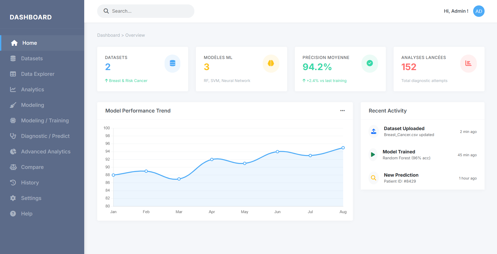

### Exploration des datasets
Interface pour consulter les datasets disponibles avec leurs caractéristiques.
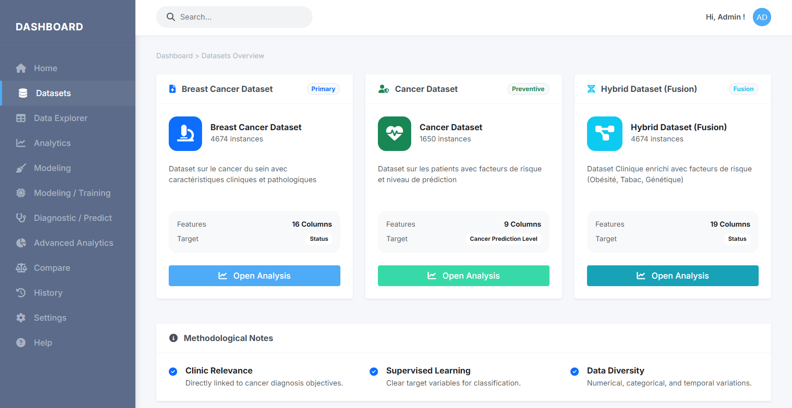

### Data Explorer - Analyse des données
Exploration interactive des données avec visualisations complètes.


### Modélisation - Entraînement des modèles
Interface pour entraîner et configurer les modèles de machine learning.
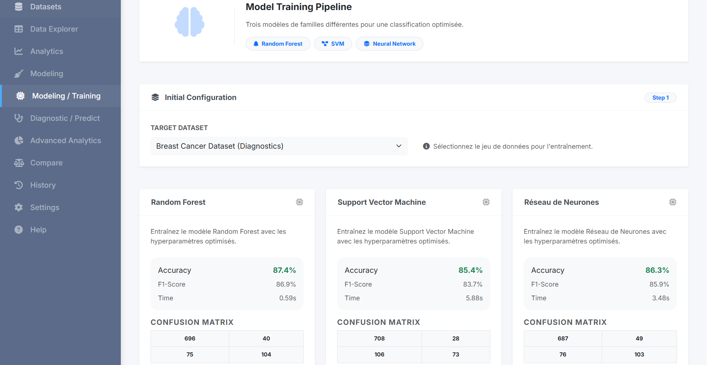

### Résultats de la modélisation
Affichage des métriques de performance des modèles entraînés.
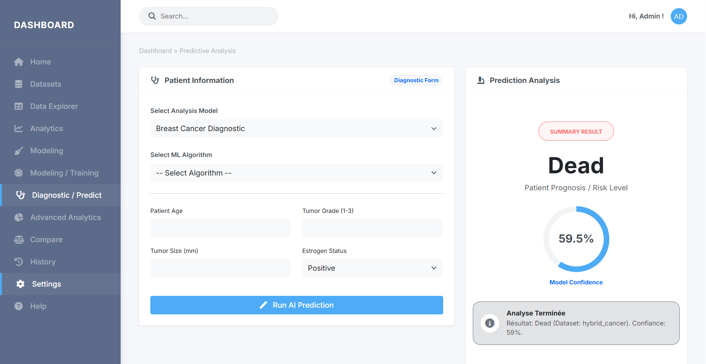

### Prédiction interactive
Formulaire pour effectuer des prédictions sur de nouvelles données.
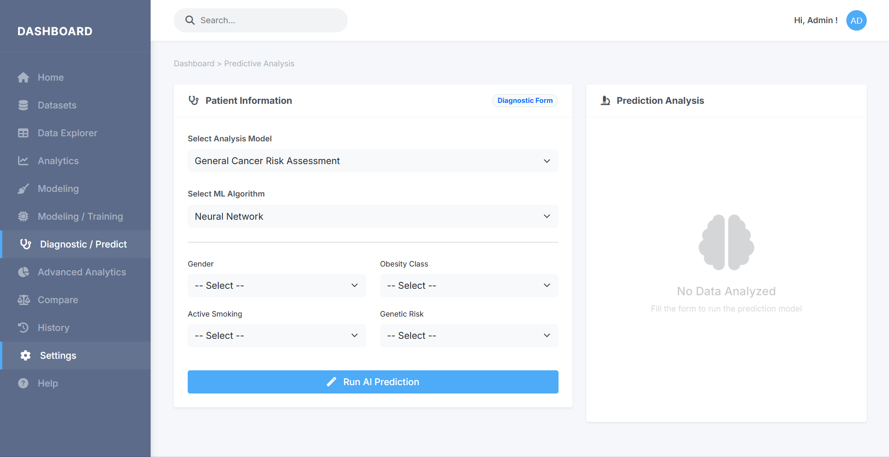

### Comparaison des modèles
Tableau comparatif avec les performances de tous les modèles.
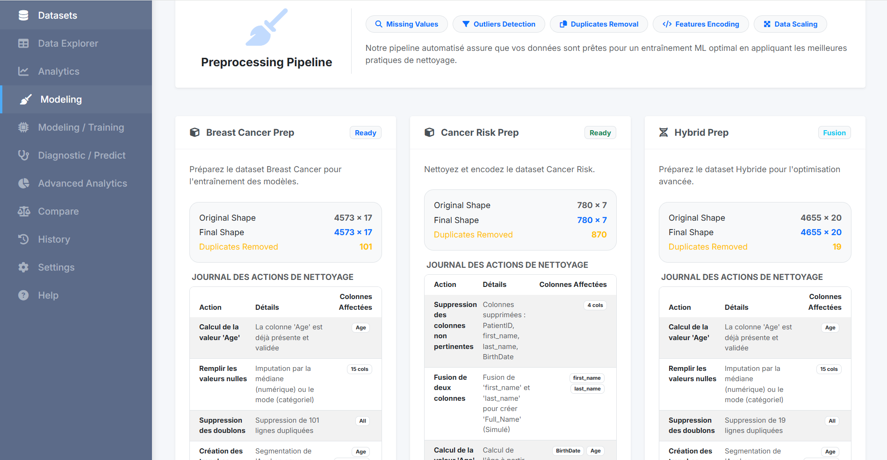

##  Analyses et visualisations générées

### Matrice de corrélation - Cancer du sein
Analyse des corrélations entre les attributs du dataset Breast Cancer.
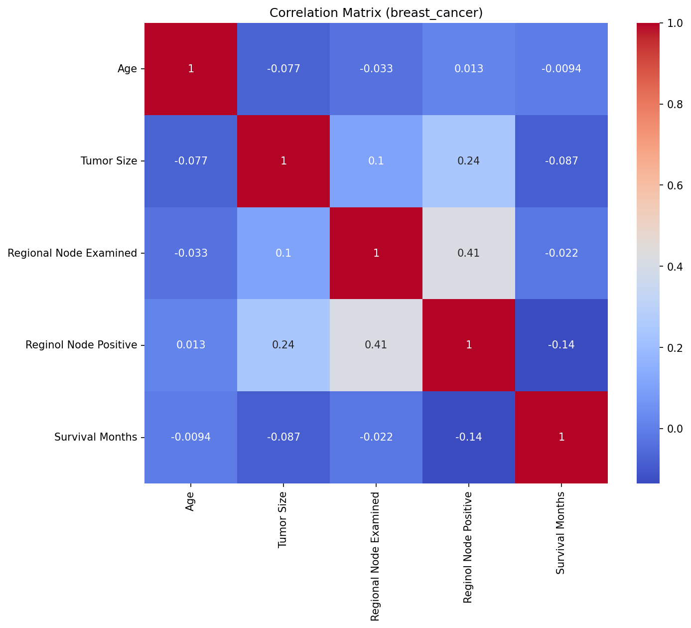

### Matrice de corrélation - Données patients
Analyse des corrélations du dataset Cancer.
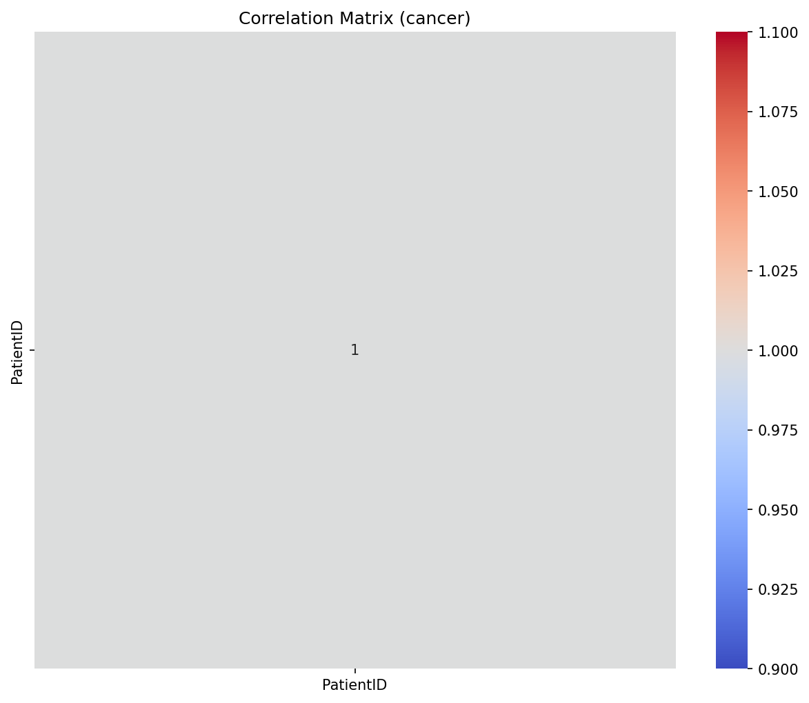

### Distribution des données - Cancer du sein
Distribution des variables du dataset Breast Cancer.
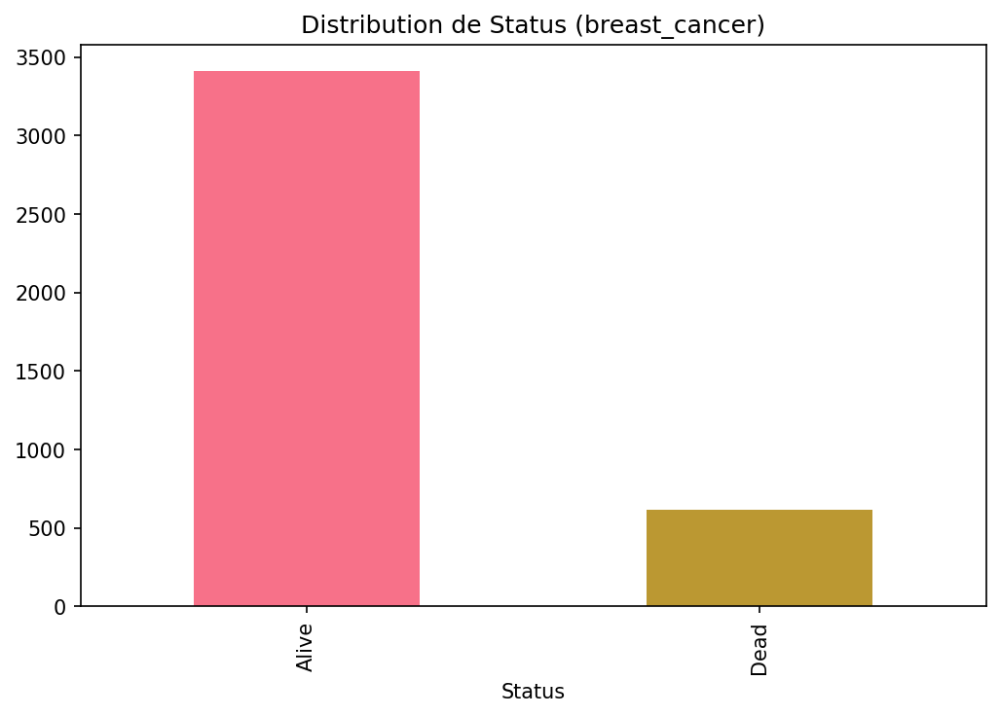

### Distribution des données - Données patients
Distribution des variables du dataset Cancer.
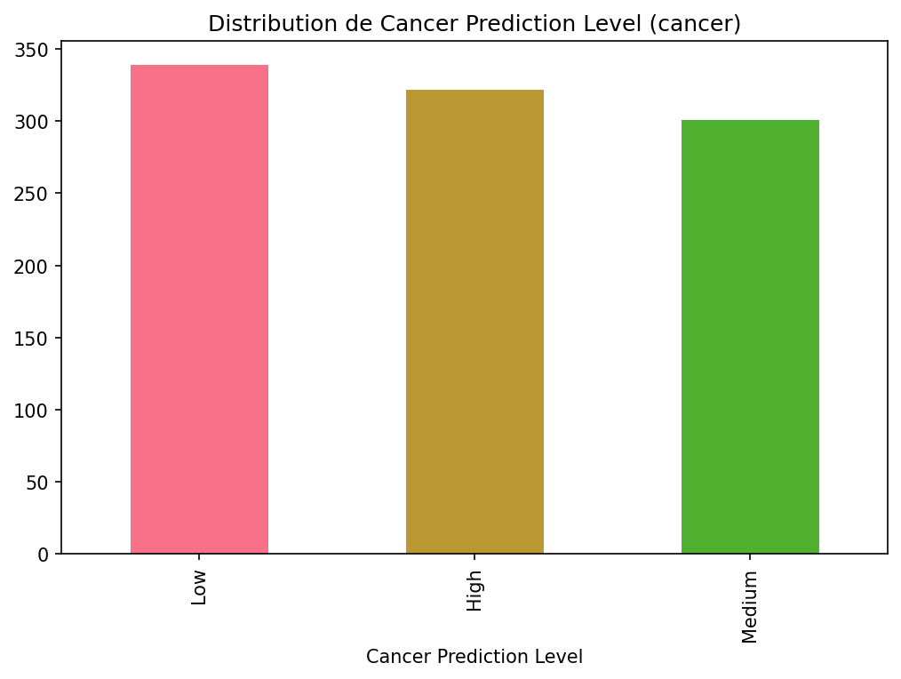

### Histogramme - Age (Cancer du sein)
Analyse détaillée de la distribution des âges.
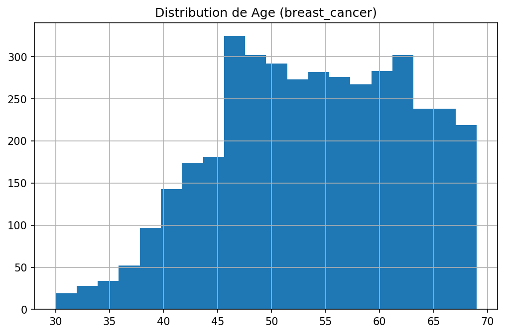

### Histogramme - Taille de tumeur (Cancer du sein)
Analyse détaillée de la distribution des tailles de tumeur.
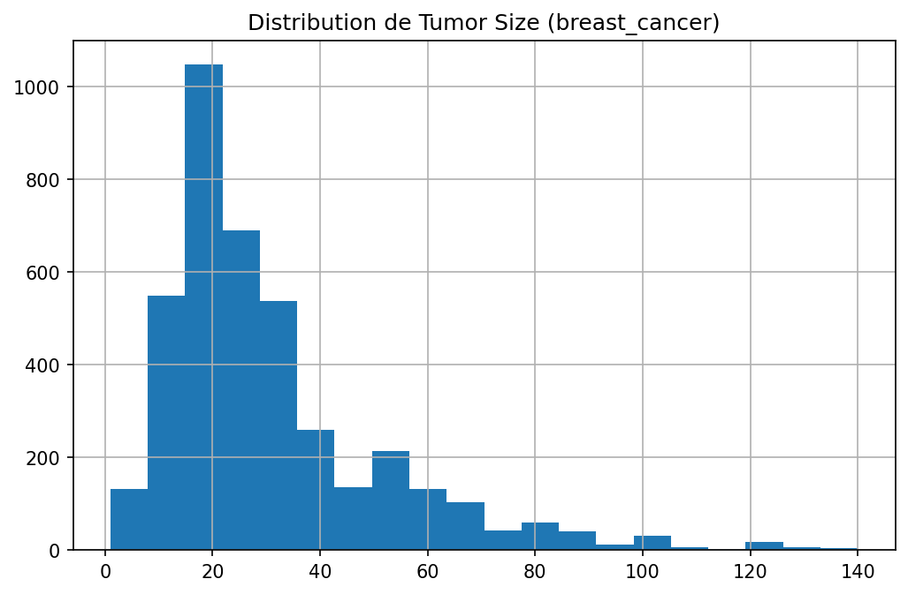

##  Installation

### Prérequis

- PHP >= 8.1
- Composer
- Python >= 3.8
- pip

### Installation rapide

**Windows :** Consultez `INSTALLATION_RAPIDE.md` pour un guide étape par étape.

**Méthode automatique (avec Chocolatey) :**
```powershell
# En PowerShell administrateur
choco install php composer -y
```

Puis dans le dossier du projet :
```bash
composer install
pip install -r python_scripts/requirements.txt
```

### Installation PHP/Symfony

1. Installer les dépendances PHP :
```bash
composer install
```

2. Configurer l'environnement :
```bash
cp .env.example .env
# Éditer .env et configurer APP_SECRET
```

3. Démarrer le serveur Symfony :
```bash
php -S localhost:8000 -t public
```

### Installation Python

1. Installer les dépendances Python :
```bash
pip install -r python_scripts/requirements.txt
```

##  Structure du projet

```
DELTACANCE/
├──  public/                    # Point d'entrée web (frontend)
│   └── index.php                 # Bootstrap de l'application
│
├──  src/                       # Code source Symfony (backend)
│   └── Controller/               # Contrôleurs de l'application
│       ├── DatasetController.php       # Gestion des datasets
│       ├── AnalysisController.php      # Analyse statistique
│       ├── PreprocessingController.php # Nettoyage des données
│       ├── TrainingController.php      # Entraînement ML
│       ├── PredictionController.php    # Prédictions
│       └── ComparisonController.php    # Comparaison des modèles
│
├──  templates/                 # Templates Twig (vues)
│   ├── base.html.twig           # Template de base
│   ├── home.html.twig           # Page d'accueil
│   ├── datasets.html.twig       # Liste des datasets
│   ├── analysis.html.twig       # Page d'analyse
│   ├── preprocessing.html.twig  # Page de preprocessing
│   ├── training.html.twig       # Page d'entraînement
│   ├── prediction.html.twig     # Formulaire de prédiction
│   └── comparison.html.twig     # Comparaison des résultats
│
├──  config/                    # Configuration Symfony
│   ├── bundles.php
│   ├── packages/
│   └── routes.yaml
│
├──  python_scripts/            # Scripts Python ML
│   ├── dataset_info.py           # Analyse des datasets
│   ├── data_analysis.py          # Statistiques et visualisations
│   ├── preprocessing.py          # Nettoyage et normalisation
│   ├── train_model.py            # Entraînement des modèles
│   ├── predict.py                # Module de prédiction
│   └── requirements.txt           # Dépendances Python
│
├──  capture/                   # Captures d'écran de l'interface
│   ├── home.png
│   ├── dataset.png
│   ├── data explorer.png
│   ├── Training.png
│   ├── resultat.png
│   ├── predict.png
│   └── modeling.png
│
├──  images/                    # Visualisations des données
│   ├── corr_breast_cancer.png    # Matrice de corrélation
│   ├── corr_cancer.png
│   ├── dist_breast_cancer.png    # Distributions
│   ├── dist_cancer.png
│   ├── hist_breast_cancer_Age.png
│   └── hist_breast_cancer_Tumor_Size.png
│
├──  Datasets
│   ├── Breast_Cancer.csv         # Dataset cancer du sein (4000+ lignes, 16 colonnes)
│   ├── Cancer_Dataset.csv        # Dataset patients (1000+ lignes, 9 colonnes)
│   └── Hybrid_Cancer_Dataset.csv # Dataset hybride combiné
│
├──  Fichiers de configuration
│   ├── composer.json             # Dépendances PHP
│   ├── composer.lock
│   ├── symfony.lock
│   ├── .env                      # Variables d'environnement
│   ├── .gitignore
│
├──  Documentation
│   ├── README.md                 # Ce fichier
│   ├── rapport.tex               # Rapport LaTeX complet
│   └── rapport.toc               # Table des matières
│
└──  Scripts de lancement
    ├── DEMARRER.bat              # Script de démarrage Windows
    ├── LANCER_PROJET.bat
    ├── CORRIGER_ERREUR.bat
    ├── start.ps1                 # Scripts PowerShell
    ├── install.ps1
    └── fix_error.ps1
```

##  Stack technique

### Backend
- **PHP 8.1+** : Langage de programmation serveur
- **Symfony 6.x** : Framework web haute performance
- **Composer** : Gestionnaire de dépendances PHP
- **Twig** : Moteur de templating

### Machine Learning (Python)
- **Scikit-learn** : Algorithmes ML (Random Forest, SVM, MLP)
- **Pandas** : Manipulation et analyse de données
- **NumPy** : Calculs numériques
- **Matplotlib** : Visualisations
- **Seaborn** : Graphiques statistiques avancés

### Frontend
- **HTML5** : Structure
- **CSS3** : Styling responsive
- **Bootstrap 5** : Framework CSS
- **JavaScript** : Interactivité

### Données
- **CSV** : Format de stockage des datasets
- **JSON** : Format pour les résultats d'analyse

##  Processus de Machine Learning implémenté

### 1. **Data Collection**
- Importation des datasets Breast_Cancer.csv et Cancer_Dataset.csv
- Création d'un dataset hybride combinant les meilleures données
- Vérification de la complétude et intégrité des données

### 2. **Exploratory Data Analysis (EDA)**
- Analyse des dimensions (nombre de lignes et colonnes)
- Statistiques descriptives complètes (mean, std, min, max, quartiles)
- Identification des valeurs manquantes et aberrantes
- Visualisation des distributions avec histogrammes et box plots
- Analyse des corrélations avec matrice de corrélation

### 3. **Data Preprocessing**
- **Handling Missing Values** : Imputation ou suppression des valeurs NaN
- **Categorical Encoding** : One-hot encoding pour les variables catégorielles
- **Feature Scaling** : Normalisation MinMax et standardisation StandardScaler
- **Class Balancing** : SMOTE pour équilibrer les classes déséquilibrées
- **Train-Test Split** : Division 80-20 pour validation

### 4. **Model Training**
Trois modèles entraînés avec optimisation des hyperparamètres :

**Random Forest**
- Nombre d'arbres : 100
- Max depth : auto-optimisé
- Critère : Gini
- Avantages : Robuste, gère bien les non-linéarités

**Support Vector Machine (SVM)**
- Kernel : RBF (Radial Basis Function)
- C : 1.0
- Gamma : auto
- Avantages : Performant en haute dimension, bon pour la séparation

**Neural Network (MLP)**
- Architecture : 64 → 32 → 16 → 1
- Activation : ReLU pour couches cachées, Sigmoid pour sortie
- Optimiseur : Adam
- Epochs : 100-200
- Avantages : Capture les non-linéarités complexes

### 5. **Model Evaluation**
Métriques complètes pour chaque modèle :
- **Accuracy** : Proportion de prédictions correctes
- **Precision** : Vraies positives / (Vraies positives + Fausses positives)
- **Recall** : Vraies positives / (Vraies positives + Faux négatifs)
- **F1-Score** : Moyenne harmonique de Precision et Recall
- **ROC-AUC** : Courbe ROC pour évaluer la discrimination
- **Confusion Matrix** : Détail des vrais/faux positifs et négatifs

### 6. **Model Comparison & Selection**
- Comparaison visuelle des performances
- Sélection du meilleur modèle par F1-Score
- Analyse de la robustesse et généralisation

### 7. **Prediction**
- Interface web pour saisir les données d'un patient
- Prédiction avec tous les modèles entraînés
- Affichage des probabilités et confiance
- Explication des résultats

##  Datasets

### Breast_Cancer.csv
- **Description** : Dataset complet sur le cancer du sein
- **Instances** : 4000+
- **Attributs** : 16 caractéristiques cliniques et pathologiques
- **Variable cible** : Status (Alive/Dead)
- **Caractéristiques** : Age, Tumor Size, Tumor Grade, Hormone Levels, etc.
- **Source** : Kaggle / UCI Machine Learning Repository

### Cancer_Dataset.csv
- **Description** : Dataset sur les facteurs de risque et prédiction
- **Instances** : 1000+
- **Attributs** : 9 variables prédictives
- **Variable cible** : Cancer Prediction Level (Low/Medium/High)
- **Caractéristiques** : Age, Family History, Smoking, BMI, etc.
- **Source** : Données publiques / Kaggle

### Hybrid_Cancer_Dataset.csv
- **Description** : Dataset fusionné combinant les meilleures données
- **Création** : Fusion intelligente de Breast_Cancer et Cancer_Dataset
- **Avantages** : Plus complet, meilleure représentation

##  Résultats obtenus

(À compléter avec les métriques réelles après entraînement)

- **Random Forest** : [Accuracy] | [Precision] | [Recall] | [F1-Score]
- **SVM** : [Accuracy] | [Precision] | [Recall] | [F1-Score]
- **Neural Network** : [Accuracy] | [Precision] | [Recall] | [F1-Score]

**Meilleur modèle** : [À déterminer selon les résultats]

##  Installation et configuration

### Prérequis système

- **PHP** >= 8.1
- **Python** >= 3.8
- **Composer** (gestionnaire de paquets PHP)
- **pip** (gestionnaire de paquets Python)
- **Navigateur web** moderne (Chrome, Firefox, Edge, Safari)

### Installation étape par étape

#### 1. Installation des dépendances PHP

Ouvrez une invite de commande/terminal dans le dossier du projet :

```bash
composer install
```

Cela va installer tous les paquets PHP nécessaires (Symfony, ses bundles, etc.)

#### 2. Configuration de l'environnement

```bash
cp .env.example .env
# Ou manuellement, éditez .env et configurez :
# APP_SECRET=un_secret_quelconque
# DATABASE_URL si nécessaire
```

#### 3. Installation des dépendances Python

```bash
pip install -r python_scripts/requirements.txt
```

Les paquets installés incluent :
- pandas : Manipulation de données
- numpy : Calculs numériques
- scikit-learn : Algorithmes ML
- matplotlib : Visualisations
- seaborn : Graphiques statistiques

#### 4. Lancement de l'application

**Méthode 1 : Serveur PHP embarqué (développement)**
```bash
php -S localhost:8000 -t public
```

Puis accédez à `http://localhost:8000` dans votre navigateur.

**Méthode 2 : Sur Windows avec les scripts fournis**
```powershell
# Script de démarrage
.\DEMARRER.bat
# ou
.\LANCER_PROJET.bat
```

**Méthode 3 : Avec un serveur web (Apache/Nginx en production)**
- Pointer la racine web vers le dossier `public/`
- Configurer les rewrites d'URL pour Symfony
- Voir la documentation Symfony pour plus de détails

### Installation automatique sur Windows

Des scripts PowerShell et batch sont fournis pour automatiser l'installation :

```powershell
# Installation automatique (administrative)
.\install.ps1

# Démarrage du projet
.\start.ps1

# Correction d'erreurs (si besoin)
.\fix_error.ps1
```

## 🔧 Utilisation de l'application

### Navigation principale

L'application est structurée en 7 sections principales :

#### 1. **Accueil**
- Vue d'ensemble du projet
- Présentation des objectifs et fonctionnalités
- Accès rapide aux sections principales

#### 2. **Exploration des Datasets**
- Visualisation des datasets disponibles
- Informations sur chaque dataset (nb lignes, colonnes, types)
- Aperçu des premières lignes
- Statistiques sommaires

#### 3. **Data Explorer (Analyse)**
- Statistiques descriptives complètes
- Visualisation des distributions
- Matrices de corrélation
- Détection des valeurs manquantes
- Histogrammes et box plots

#### 4. **Preprocessing**
- Visualisation du preprocessing effectué
- Détails sur le traitement des valeurs manquantes
- Information sur l'encodage des variables catégorielles
- Résumé de la normalisation appliquée

#### 5. **Training (Entraînement)**
- Formulaire pour configurer l'entraînement
- Sélection des modèles à entraîner
- Paramètres d'entraînement ajustables
- Statut d'avancement en temps réel
- Affichage des résultats bruts

#### 6. **Comparaison des Modèles**
- Tableau comparatif de tous les modèles
- Métriques côte à côte (Accuracy, Precision, Recall, F1)
- Graphiques comparatifs
- Classement des modèles
- Sélection du meilleur modèle

#### 7. **Prédiction**
- Formulaire interactif pour entrer les données d'un patient
- Validation des entrées en temps réel
- Prédiction avec le meilleur modèle
- Affichage de la probabilité et confiance
- Interprétation du résultat

## Flux de travail recommandé

1. **Démarrer l'application** : `php -S localhost:8000 -t public`
2. **Consulter l'accueil** : Comprendre les objectifs
3. **Explorer les datasets** : Examiner les données disponibles
4. **Analyser les données** : Comprendre les distributions et corrélations
5. **Entraîner les modèles** : Lancer l'entraînement (peut prendre quelques minutes)
6. **Comparer les résultats** : Évaluer la performance des modèles
7. **Faire des prédictions** : Utiliser le meilleur modèle pour prédire

##  Dépannage

### Erreur : "PHP not found"
Assurez-vous que PHP est correctement installé et ajouté au PATH système.

### Erreur : "Composer not found"
Installez Composer depuis https://getcomposer.org/

### Erreur : "Python modules not found"
Réinstallez les dépendances Python :
```bash
pip install --upgrade -r python_scripts/requirements.txt
```

### Erreur : "Port 8000 already in use"
Utilisez un autre port :
```bash
php -S localhost:8001 -t public
```

### Scripts d'aide
- `CORRIGER_ERREUR.bat` : Corrige les erreurs courantes
- `fix_error.ps1` : Version PowerShell du correcteur d'erreurs

##  Ressources et documentation

### Fichiers de documentation
- **rapport.tex** : Rapport complet en LaTeX (générez le PDF avec `pdflatex rapport.tex`)
- **rapport.toc** : Table des matières du rapport
- **README.md** : Ce fichier

### Liens utiles
- [Documentation Symfony](https://symfony.com/doc/)
- [Documentation Scikit-learn](https://scikit-learn.org/)
- [Documentation Pandas](https://pandas.pydata.org/)
- [Documentation Matplotlib](https://matplotlib.org/)
- [Kaggle Datasets](https://www.kaggle.com/datasets)
- [UCI ML Repository](https://archive.ics.uci.edu/ml/)

##  Contribution et support

### Rapporter un bug
Si vous rencontrez un problème, vérifiez d'abord le fichier `DEMARRER.bat` ou `CORRIGER_ERREUR.bat`.

### Suggestions d'améliorations futures
- Intégration avec une base de données pour persister les résultats
- API REST pour intégration tierce
- Entraînement en temps réel avec WebSockets
- Support de nouveaux modèles (XGBoost, LightGBM, CatBoost)
- Application mobile pour les prédictions
- Export des résultats en PDF/Excel

##  Auteur et équipe

**Projet DELTACANCE** - Système d'aide au diagnostic médical

JOSEPH MUKUBU KAPOYA

##  Licence

MIT License - Libre d'utilisation et de modification

Voir le fichier LICENSE pour plus de détails.

##  Support et Contact

Pour toute question ou problème :
1. Consultez la documentation dans le rapport.tex
2. Vérifiez les scripts de dépannage (CORRIGER_ERREUR.bat)
3. Examinez les logs de l'application

---

**Version actuelle** : 1.0.0  
**Dernière mise à jour** : 2024  
**Status** : Production Ready


